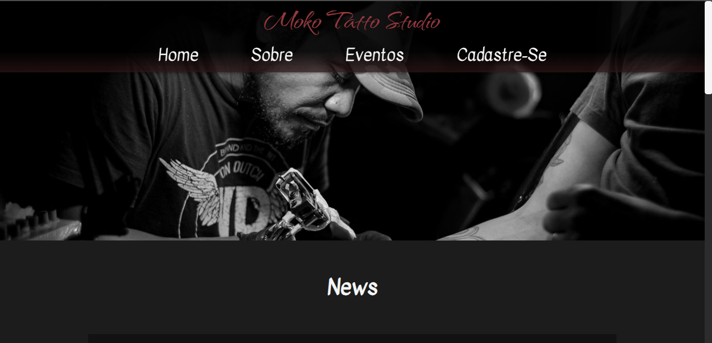

<p align="center">
    
</p>

<h1 align='center'>🖋️ Moko Tatto Studio 🖋️</h1>

<h1> ⚠️ Status: </h1>
<h4><strong>✅ Projeto Finalizado.</strong></h4>

<h1 align='center'>📃 Sobre o projeto:</h1>

<h3>Desenvolvemos um site em React que consumiria dados de uma API Rest especifica criada por nós. Projeto desenvolvido em Squad.</h3>

<h1> 📙 Pré-requisitos:</h1>
<ul>
<li><h4>VS Code;</h4></li>
<li><h4>Git;</h4></li>
<li><h4>Github;</h4></li>
</ul>

<h1> 💻 Link do repositório no <strong>VERCEL</strong>:</h1>
```
Link Aqui: 
```

<h1> ⚙️ Dependências e Libs Instaladas:</h1>
<ul>
<li><h4>NPM;</h4></li>
<li><h4>Vite;</h4></li>
<li><h4>React Router Dom;</h4></li>
<li><h4>React Icons;</h4></li>
</ul>

<h1> ⚙️ Instalação local:</h1>
<h4>

📌 Clonar repositório:
```
Teste
```

📌 Entrar na pasta:
```
Teste
```

📌 Instalar todas as dependências necessárias para rodar a aplicação:
```
Teste
```

📌 Iniciar o Projeto:
```
Teste
```
</h4>

<h1> 🚀 Uso da Aplicação:</h1>
<ul>
<li><strong>1: Acessar o link disponibilizado;</strong></li>
<li><strong>2: Dentro do site aberto no navegador, o usuario poderá navegar pelas paginas: Home, Sobre, Taguagens e FAQ.</strong></li>
<li><strong>3: Na página "Tatuagens" o usuário pode ver as tatoos disponibilizadas, escolher a sua, comprar e agendar um horario para vir ao estúdio para ser tatuado.</strong></li>
</ul>


<h1> 🧱 Database:</h1>
<h4> API Rest do projeto Moko Tatto Studio, criado em Squad.</h4>

<h1> 🐛 Solução de problemas:</h1>
<h4> Favor entrar em contato com a equipe 💬</h4>

<h1 align='center'> 👷 Contribuintes:</h1>

|   |  |  |  
| ------------- | ------------- | -------------- | -------------- |
|  **Edson** 👍 | **Guilherme** 👍 | **Igor** 👍 | **Pedro**👍 |
| **[Github](https://github.com/Edson-7728)** 💻  | **[Github](https://github.com/Dev-DaMata)** 💻  | **[Github](https://github.com/igorsans)** 💻  | **[Github](https://github.com/Garridopedro)** 💻  |
| **[Linkedin](https://www.linkedin.com/in/edson-vieira7728/)** 💻 | **[Linkedin](https://www.linkedin.com/in/guilhermecordeirodamata/)** 💻 | **[Linkedin](https://www.linkedin.com/in/devsantos/)** 💻 | **[Linkedin](https://www.linkedin.com/in/pedro-garrido-1a8482205)** 💻 |